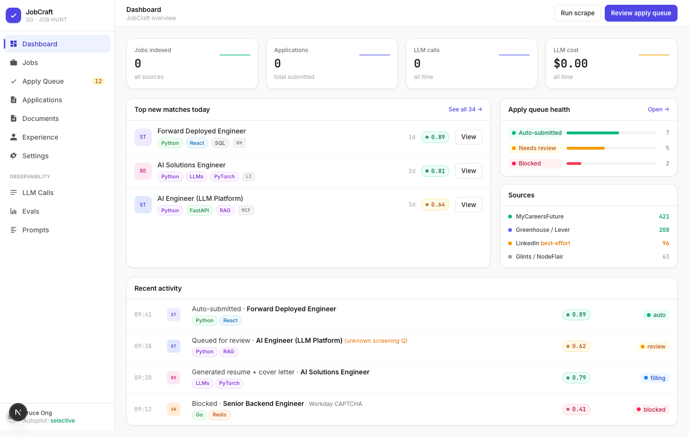
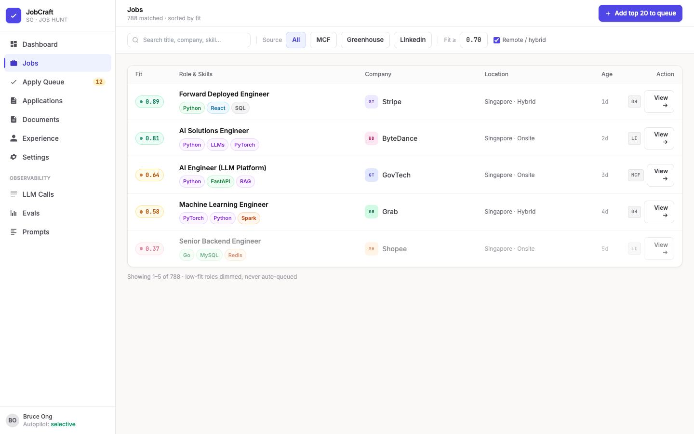
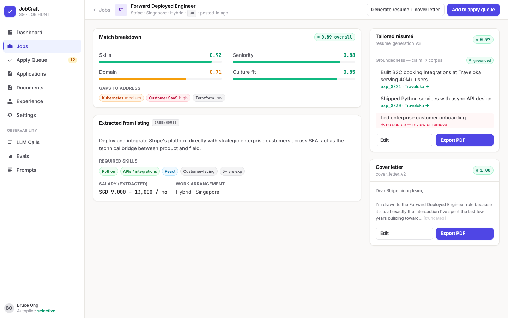
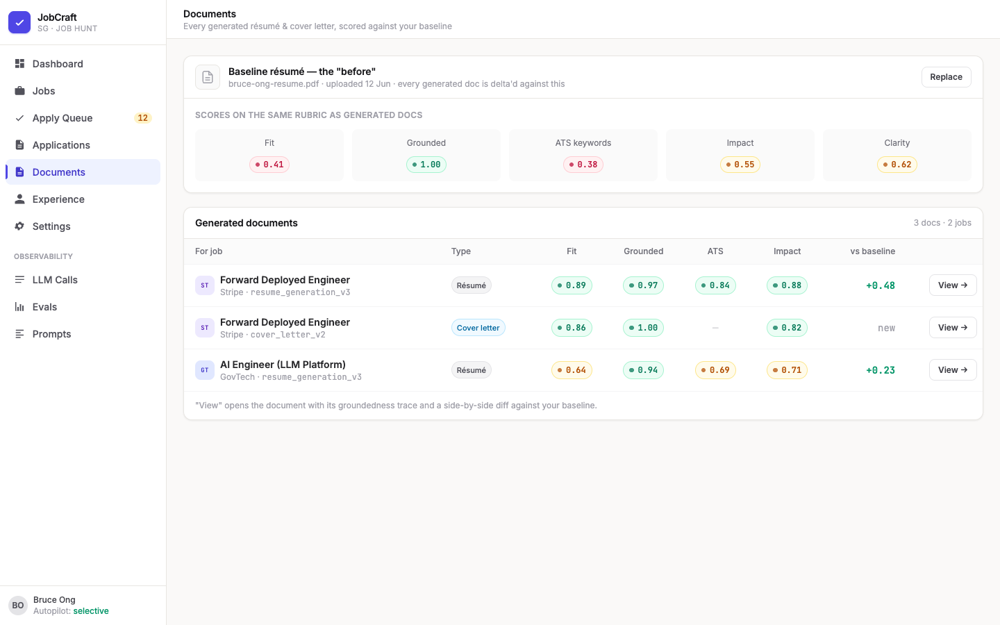
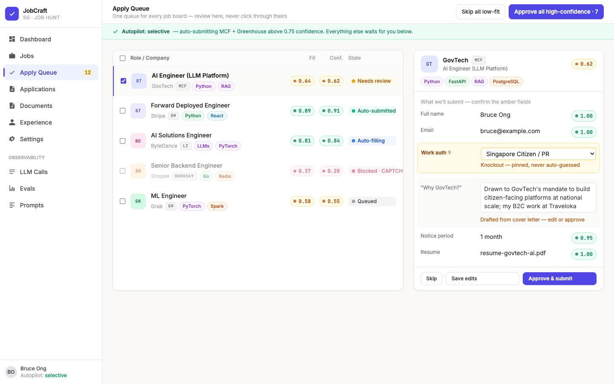
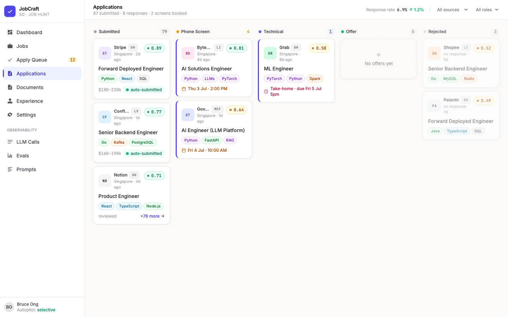
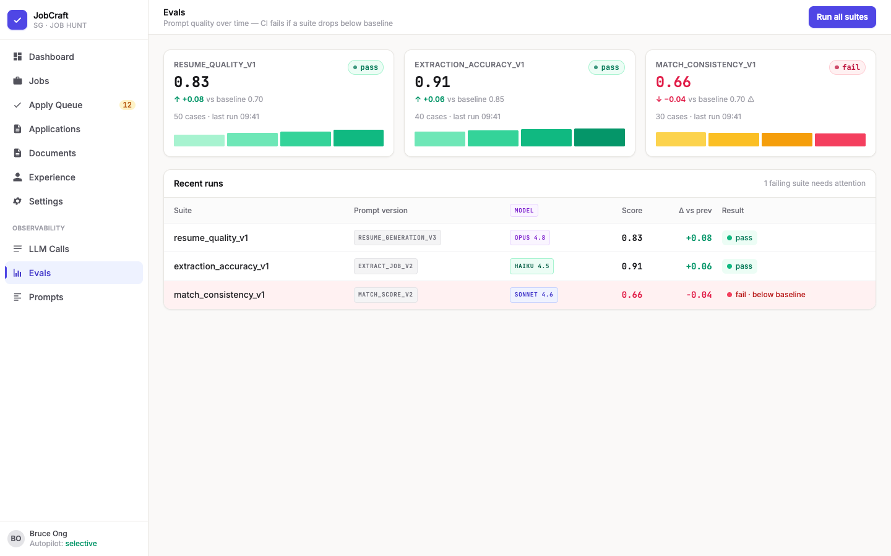
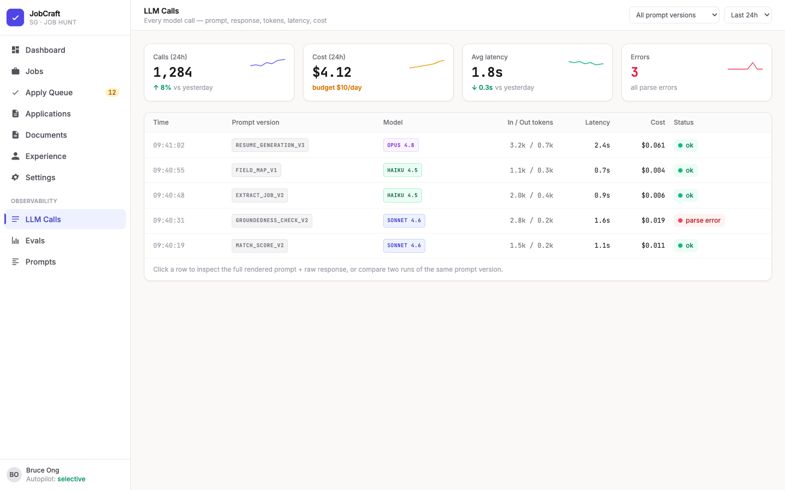

# JobCraft

> AI-powered job targeting, resume generation, and mass safe auto-apply — built for the Singapore market.

**Status:** Phases 0–8 implemented · 463 backend tests green · Frontend builds clean

---

## What it does

JobCraft scrapes SG job boards (Greenhouse, Lever, MCF, LinkedIn), scores every listing against your experience corpus using a two-stage AI matcher, generates strictly-grounded tailored résumés and cover letters, then auto-applies through a confidence-gated queue — all with full LLM observability and an eval suite to catch prompt regressions.

The two design principles it's built around:

1. **Strictly grounded generation.** Every claim in a generated résumé traces back to a real experience item you've recorded. No hallucination.
2. **Production-grade AI engineering.** Prompt versioning, evals, structured outputs, RAG, LLM observability — the same concerns a serious enterprise AI deployment cares about.

---

## Screenshots

### Dashboard
Real-time overview: jobs indexed, applications submitted, LLM spend, top matches, and recent pipeline activity.



---

### Jobs — AI fit scoring
Every scraped job is ranked by a two-stage matcher: fast embedding pre-filter → LLM-as-judge with dimension scores. Low-fit roles are dimmed and never auto-queued.



---

### Job detail — match breakdown + generated documents
Fit broken down across Skills, Seniority, Domain, and Culture Fit. Gaps surfaced. Résumé and cover letter generated on-demand, each claim traced to a source experience item.



---

### Documents — groundedness scoring
Every generated document is scored on Fit, Groundedness, ATS keywords, Impact, and Clarity — delta'd against your baseline résumé so you can see exactly what improved.



---

### Apply Queue — confidence-gated auto-apply
One queue for all job boards. The gate blocks on: low confidence, CAPTCHA, unresolved knockout fields (visa/auth — never guessed by the LLM), or untrusted source. Autopilot submits only when all checks pass.



---

### Applications — Kanban pipeline
Full lifecycle tracking from submission through phone screen, technical, onsite, offer, and rejection. Email sync auto-proposes status transitions from recruiter emails.



---

### Evals — prompt regression CI
YAML-defined eval suites run against every prompt version. Score tracked over time; CI fails if a suite drops below its baseline. Catches prompt regressions before they reach users.



---

### LLM Calls — full observability
Every LLM call logged: prompt version, model, token counts, latency, cost, parsed response. Filter by prompt version or time window. Click any row to inspect the full rendered prompt and raw response.



---

## How it works

```
Job boards (Greenhouse / Lever / MCF)
        │  scrape + structured extraction
        ▼
  Job Postings DB ──► Two-stage matcher ──► Match score + gaps
                         │ 1. Embedding pre-filter (fast)
                         │ 2. LLM-as-judge (deep)
                         ▼
              Experience Corpus (your résumé as structured data)
                         │
                         ▼
              Grounded Generator ──► Résumé + Cover letter
                         │           every claim traced to source
                         ▼
              Confidence Gate ──► Apply Queue ──► Auto-submit
                  checks:              │
                  · fit score          │  human review for
                  · field confidence   │  amber/blocked items
                  · knockout fields    │
                  · CAPTCHA present    ▼
                                  Applications DB
                                       │
                                  Email sync ──► Status events
                                  (Gmail/Outlook,   (proposed →
                                   read-only)        confirm/dismiss)
```

---

## The Stack

| Layer | Technology |
|---|---|
| Backend | Python 3.13 · FastAPI · SQLAlchemy 2.0 async · Alembic |
| Database | PostgreSQL 16 · Qdrant (vector store) · Redis (arq workers) |
| LLM | Anthropic / OpenAI / DeepSeek (switchable via `JOBCRAFT_LLM_PROVIDER`) |
| Frontend | Next.js 15 · React 19 · Tailwind v4 · shadcn/ui |
| Testing | pytest-asyncio · 463 tests · zero Docker required in CI |
| Observability | Full LLM call log · prompt versioning · YAML eval suites |

---

## Engineering highlights

- **Apply engine safety invariants** — knockout fields (`work_authorization`, `visa_status`, `citizenship`, `years_of_experience`) are sourced exclusively from `profile_fields`. The LLM is structurally unreachable for these values. CAPTCHA checked pre-submit; never bypassed.
- **Grounded generation** — `grounded_ratio` recomputed server-side from claim list; empty claims → 0.0. LLM-returned ratio is ignored.
- **Savepoint isolation** — all speculative inserts wrapped in `begin_nested()` so IntegrityError on a single item rolls back only that item, not the outer transaction.
- **Network-free tests** — `MockAdapter`, `FakeEmbeddingAdapter`, `InMemoryVectorStore`, `FakeFormSource`, `FakeEmailProvider`. The full 463-test suite runs with no API keys, no Qdrant, no Redis, no browser.
- **Email privacy** — `oauth_token_enc` never returned by any API, never logged. Unmatched email bodies never persisted. Disconnect deletes the token row immediately.

---

## Quickstart

**With Docker (full stack):**
```bash
docker compose up -d          # Postgres + Qdrant + Redis
cd backend
python -m venv .venv && source .venv/bin/activate
pip install -e '.[dev]'
cp .env.example .env          # add ANTHROPIC_API_KEY (or DEEPSEEK_API_KEY)
alembic upgrade head
uvicorn app.main:app --reload  # http://localhost:8000
# new terminal:
cd frontend && pnpm install && pnpm dev  # http://localhost:3000
```

**Without Docker (DeepSeek + SQLite — no Postgres/Qdrant/Redis needed):**
```bash
cd backend
python -m venv .venv && source .venv/bin/activate
pip install -e '.[dev]'

# Create backend/.env with:
#   JOBCRAFT_DATABASE_URL=sqlite+aiosqlite:///./dev.db
#   JOBCRAFT_LLM_PROVIDER=deepseek
#   JOBCRAFT_EMBEDDING_PROVIDER=fake
#   JOBCRAFT_VECTOR_STORE=memory
#   DEEPSEEK_API_KEY=<your key>

python ../scripts/create_db.py   # creates schema from ORM models
alembic stamp head                # marks migrations as current
uvicorn app.main:app --reload     # http://localhost:8000

# new terminal:
cd frontend && pnpm install && pnpm dev  # http://localhost:3000
```

---

## Architecture & Spec

- [docs/architecture.md](docs/architecture.md) — component map, data model, API surface, design decisions
- [docs/specs/2026-06-22-jobcraft-design.md](docs/specs/2026-06-22-jobcraft-design.md) — full product spec
- [docs/design/mockups/](docs/design/mockups/) — HTML+Tailwind mockups (open `dashboard.html`)

---

## License

MIT
